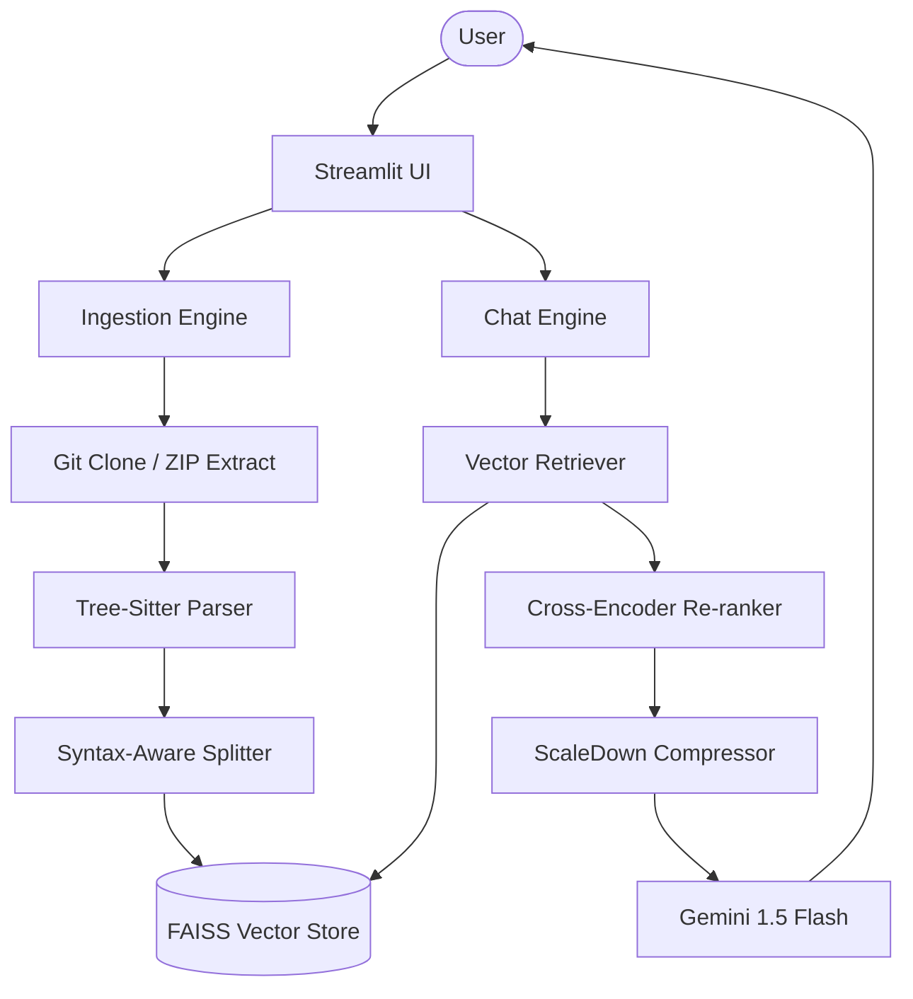

# System Architecture

This document describes the high-level architecture of the **Codebase Assistant (RAG)** system.

## 🏗 High-Level Design

The system follows a standard Retrieval-Augmented Generation (RAG) architecture with specialized enhancements for code context.

## 🛠 Component Breakdown

### 1. Ingestion Engine (`ingect_data.py`)
- **Git Integration**: Uses `GitPython` to clone repositories into temporary directories.
- **Parsing**: Employs `tree-sitter` for syntax-accurate code understanding.
- **Chunking**: Uses LlamaIndex's `CodeSplitter` to ensure chunks follow logical boundaries (functions/classes) rather than arbitrary character counts.
- **Vector Storage**: Uses `FAISS` for efficient similarity search.

### 2. Chat Engine (`chat_engine.py`)
- **Retriever**: Fetches the top 10 nodes based on cosine similarity.
- **Re-ranker**: Uses a sentence-transformer (`ms-marco-MiniLM-L-2-v2`) to re-score the top 10 nodes, keeping the most relevant 5.
- **ScaleDown Compressor**: Our custom post-processor that shrinks supporting context while keeping top nodes intact.

### 3. LLM Integration
- **Model**: `gemini-1.5-flash` for fast, cost-effective, and accurate code reasoning.
- **Prompting**: A specialized "Senior Architect" system prompt handles complex walkthroughs and architectural queries.
